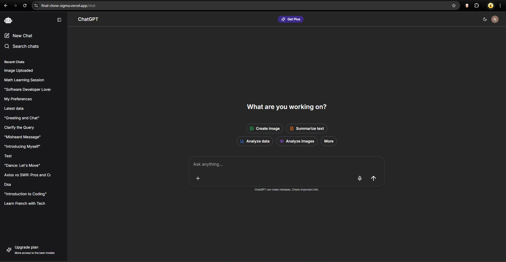

# 🧠 ChatGPT Clone with Next.js, Vercel AI SDK, Clerk, Mem0 & Cloudinary

A powerful, production-grade ChatGPT clone built with **Next.js**, using **Vercel AI SDK**, **Google Gemini AI**, **Clerk for authentication**, **Mem0 for memory**, and **Cloudinary** for media uploads. Fully responsive and mimics the original ChatGPT experience.

---

## 🚀 Features

- 🔐 Authentication & Authorization with **Clerk**
- 🤖 AI chat via **Vercel AI SDK + Google Gemini**
- 💾 Persistent memory using **Mem0**
- 📁 File & Image Uploads (PDF, DOCX, PNG, etc.) via **Cloudinary**
- 💬 Editable messages with regeneration
- 📝 Edit chat titles
- 🗑️ Delete individual messages/chats
- 🔍 Search messages (with **debounce + pagination**)
- ⚡ Real-time streaming responses
- 🧠 Context trimming for limited-token models
- 📱 Fully responsive + ARIA compliant

---

## 🧱 Folder Structure

```bash
app/
├── api/
│   ├── chat/                # Routes for chat input and response
│   ├── chats/               # Fetch user chats
│   ├── generate-title/      # Title generation API
│   ├── search-chats/        # Search messages with debounce & pagination
│   ├── test/                # Experimental routes
│   ├── tools/               # Routes for tool-based routing
│   └── upload/              # Upload to Cloudinary
│
├── chat/
│   ├── [chatId]/            # Dynamic chat page
│   │   ├── layout.tsx
│   │   └── page.tsx
│   └── pricing/
│       └── page.tsx
│
├── sign-in/                 # Clerk sign-in page
├── sign-up/                 # Clerk sign-up page
├── layout.tsx               # Root layout
├── page.tsx                 # Landing page
├── not-found.tsx           # 404 page
│
components/
├── chat/
│   ├── chat-dropdown.tsx
│   ├── chat-file-upload.tsx
│   ├── chat-interface.tsx
│   ├── chat-message.tsx
│   ├── chat-search-dialog.tsx
│   └── chat-sidebar.tsx
│
├── ui/
│   ├── delete-chat-dialog.tsx
│   ├── extraMobile.tsx
│   ├── header.tsx
│   ├── theme-provider.tsx
│   └── theme-toggle.tsx
│
hooks/
├── use-chats.ts
├── use-current-chat.ts
├── use-mobile.ts
├── use-speechRecognition.ts
└── use-toast.ts
│
lib/
├── api.ts
├── mongodb.ts
├── speechRecognition.ts
├── store.ts
├── toolRouter.ts
└── utils.ts
```

---

## 🧪 Tech Stack

| Tech               | Usage                                |
|--------------------|----------------------------------------|
| **Next.js**         | Frontend + Backend (App Router)       |
| **Clerk**           | Authentication & Authorization        |
| **Vercel AI SDK**   | AI message streaming + model routing  |
| **Google Gemini AI**| Language model                        |
| **Mem0**            | Memory storage per user/chat          |
| **Cloudinary**      | Image & file uploads                  |
| **Shadcn UI**       | Accessible component design           |
| **Tailwind CSS**    | Styling                               |
| **MongoDB**         | Chat/message persistence              |

---

## ⚙️ Setup Instructions

### 1. Clone the repository

```bash
git clone https://github.com/nxtnilesh/final-clone.git
cd chatgpt-clone
```

### 2. Install dependencies

```bash
pnpm install
# or
npm install
```

### 3. Environment Variables

Create a `.env.local` file in root:

```env
NEXT_PUBLIC_CLERK_PUBLISHABLE_KEY=your_clerk_publishable_key
CLERK_SECRET_KEY=your_clerk_secret_key
MONGODB_URI=mongodb_url
NEXT_GOOGLE_API_KEY=your_google_ai_key
NEXT_OPENROUTER_API_KE=your_vercel_ai_sdk_key
CLOUDINARY_CLOUD_NAME=your_cloud_name
CLOUDINARY_API_KEY=your_api_key
CLOUDINARY_API_SECRET=your_api_secret
NEXT_MEMO_API_KEY=your_mem0_key
```

---

## 💻 Development

Run development server:

```bash
pnpm dev
# or
npm run dev
```

Open [http://localhost:3000](http://localhost:3000)

---

## 🔐 Authentication

- **Sign-in/Sign-up** pages are built with **Clerk**
- Auth state is managed using `auth()` or `useAuth()` from Clerk
- Only authenticated users can access chat routes

---

## 📤 File Upload

- Upload handled via `/api/upload`
---

## 🔍 Search

- Full-text search of messages
- Implements **debounced input** and **pagination** for performance

---

## 🧠 Memory with Mem0

- Adds persistent context per user/chat
- Stored using Mem0’s API

---

## 📦 Deployment

- Push to GitHub
- Deploy via [Vercel](https://vercel.com/)
- Set environment variables in the Vercel dashboard

---

## 📸 Screenshots


---

## Will be adding more data
